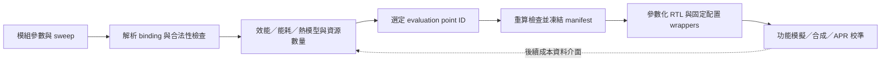

# 評估參數 → 對應 RTL

0.3 已增加自動選點、PPA 成本 adapter 與固定驗收，入口為 [OPERATIONS_MANUAL.md](OPERATIONS_MANUAL.md)。以下保留 0.2 的模組與基礎評估契約；新最佳化結果的有效指標請讀 `optimization_binding.json.effective_metrics`。

這一版已建立六種可參數化 SystemVerilog 模組與可執行的匯出流程。評估器與 RTL wrapper 共用同一份已解析參數；不是由 LLM 在每次評估後重新猜一份 RTL。



## 參數的三個層次

| 層次 | 示例 | 如何處理 |
|---|---|---|
| 結構／elaboration | MAC ROWS/COLS、DATA_W、ACC_W、BANKS、DEPTH、WIDTH、STAGES | 寫入 RTL instance parameters，改變資源與介面 |
| 操作／runtime | valid/ready、MAC clear/last、記憶體地址與資料 | RTL ports，由 testbench／未來 controller 驅動 |
| 實體／模型 | HB pitch、tier、pad mode、工作頻率、Cu 熱阻、cooling | manifest、模型輸入；頻率另輸出 SDC。pitch 不直接變成邏輯閘 |

改 pitch 可使較寬連線成為可行候選，但不會擅自替同一個候選改 WIDTH、增加計算單元或降低功耗。

## 已實作模組

| 模組 | 結構參數 | 行為／邊界 |
|---|---|---|
| `int_mac_array` | ROWS, COLS, DATA_W, ACC_W | signed integer outer-product MAC；每次接受 ROWS 與 COLS 個 operand；clear 重啟累積、last 輸出；溢位 wrap。不是 FP8/BF16 或 systolic timing 模型 |
| `banked_sram` | BANKS, DATA_W, DEPTH | 每 bank 一個同步 1RW port，讀取一拍；無 memory reset；尚未綁 foundry SRAM |
| `register_file` | LANES, DATA_W, DEPTH | 每 lane 2 個非同步讀 port、1 個同步寫 port；無 zero register／bypass |
| `stream_fifo` | WIDTH, DEPTH | ready/valid，支持 depth=1 與非 2 次方深度，滿載同時 pop/push |
| `hb_link` | WIDTH, STAGES | 同時脈 elastic pipeline；每拍最多一個 payload；無 PHY、CDC、pad RC 或可製造性保證 |
| `rr_arbiter` | PORTS | round-robin 選擇與 advance；不是完整 NoC router |

`module_specs.py` 登錄合法型別、參數範圍、ports 與邏輯資源公式。新增模組要同時提供這四項、RTL、功能測試與評估 adapter；不允許用不存在的浮點模組替代整數實作。

## 操作流程

在 `hb_pitch_lab` 目錄執行：

```sh
python3 module_flow.py evaluate --design examples/modules.json --out results/module_demo
```

目前示例掃描 ROWS={4,8}、link.WIDTH={64,128,256}、pitch={8,4,2} µm，共 18 個候選。`bindings` 將 `link.WIDTH` 傳給 `queue.WIDTH`，所以兩者介面一致。查看 `results/module_demo/EVALUATION.md` 後，以該次的 point ID 匯出：

```sh
python3 module_flow.py export --evaluation results/module_demo/evaluation.json --point <point-ID> --out results/my_selected_rtl
```

point ID 可用唯一前綴。匯出目錄必須不存在；舊候選保持不變。`results/generated_v02` 是已匯出的示例，採 2 tiles、8×4 integer MAC/tile、128-bit link、2 link stages、4 µm pitch；它用來驗證流程，**不是最佳 PPA 或最佳 pitch 的宣告**。

輸出包含：

- 六類實作 RTL、每個 module 的固定參數 wrapper。
- `lab_tile_top`、複製 tile 的 `lab_system_top`、每 tile 的 `lab_tier0_top` 與 `lab_tier1_top` 分割視圖。
- `manifest.json`：評估結果、凍結參數、來源雜湊、module 資源數量、跨層介面與校準 key。
- `files.f`、clock-only `clock.sdc`、四個 Yosys 結構檢查腳本。

目前僅明示的 FIFO → HB ready/valid 邊有接線；其他模組的 ports 均露出供 testbench／controller 操作。**這是 module benchmark assembly，尚不是可執行 AI 程式的完整 GPU。** tier tops 是每 tile 的實體分割起點，不是已完成兩顆 die 的 floorplan。跨 tier 的 stream 有 WIDTH 根 payload、valid forward 與 ready backward；clock/reset、P/G/test 另行規劃。幾何模型 `signal_fraction` 是扣除這些預留之後的 payload 配額，不能當作所有 HB 導線總數。

## 參數如何進入評估

以每次乘加計 2 operations，單 MAC array 有 R×C 個乘加單元、T tiles、時脈 f：

\[
P_{peak}=2RCTf,\quad B_{SRAM}=N_{bank}W_{SRAM}Tf/8,
\quad B_{HB}=W_{HB}Tf\eta/8.
\]

頻寬以上用 byte/s，η 是使用者輸入的有效率。結構容量為：

\[
M_{SRAM}=N_{bank}W_{SRAM}D_{SRAM},\quad
M_{FIFO}=W_{FIFO}D_{FIFO},\quad
FF_{link}=S(W_{HB}+1).
\]

示例 R=8、C=4、T=2、f=250 MHz、W_HB=128、η=0.8，得到 32 GOP/s、HB 6.4 GB/s。4 banks × 64 bits × 32 words 為每 tile 8192 memory bits，SRAM 聚合讀頻寬上限 16 GB/s；2-stage link 每 tile 有 258 個邏輯 state bits。這些數量可直接對照 RTL；實際合成可能優化掉部分狀態，不能把 bit count 當成 µm²。

時間模型仍是 compute、HB、SRAM、fabric、external 的完全重疊近似，再加 `(link.STAGES+1)/f` 的 FIFO／link 理想啟動項。**不是生成電路的 cycle-accurate workload 執行時間**；目前未把 SRAM 資料實際送進 MAC，也未實作工作負載排程。

目前 thermal adapter 固定 compute 在 tier 0（靠上方 cooling boundary）、SRAM 在 tier 1。背景功率與兩層空間權重由使用者供應，link energy 各半分配；不是依每個 generated register 的實際位置建立 power map。任意切割、logic-on-logic 與細粒度 RF 分割需要新的 adapter，不能直接沿用本版熱結論。

## 哪些 PPA 結果尚不能推導

這次確保了「配置能映射到實際 RTL」，但尚未完成「每個參數都有經校準的 PPA 成本」：

- DEPTH、RF ports 的結構變化已反映到 RTL／resource counts；尚未反映到 bank conflicts、buffer 命中率與每個模組的實際 area/leakage。
- compute pJ/op、memory pJ/byte 等仍是示例假設；大陣列或 SRAM 深度改變時，不應沿用同一常數宣稱真實能效。
- 現有 area 指標是 HB site budget 與端點 proxy，未包含完整 compute／SRAM／RF cell area；不輸出虛構的總 die area。
- 250 MHz 是設計目標，不代表 timing closure。泛用合成也不能代替製程 Liberty、SRAM macro、HB RC 與 APR。

0.3 已支援完整 point ID 的逐點 PPA 匯入及簡單資源係數模型。下一步用 manifest 的 `calibration_key`（module type＋完整參數＋時脈＋RTL library hash），配合 node、library corner、V/T 與 flow 版本記錄 module synthesis／APR 樣本，建立更完整的 energy/action、leakage、delay 擬合與動態 power trace；這些 action-level 擬合仍在 roadmap 中。

## 驗證與重現

```sh
python3 -m unittest discover -s tests -v
python3 check_rtl.py --generated results/generated_v02 --out results/rtl_validation_v02
python3 check_synthesis.py --generated results/generated_v02 --out results/synthesis_validation_v02
```

`check_rtl.py` 使用 PATH 的 Icarus/VVP，或本機已放入 `.tooldeps/icarus-verilog/13.0` 的工具；可用 `IVERILOG`、`VVP` 指定其他安裝。工具下載不包含於 Python requirements。已驗證 25 項 Python 測試、17 組 RTL scoreboard simulations 與四個 generated tops elaboration。測試包括 signed MAC 與 wrap、背壓穩定性／順序、滿載 pop/push、depth=1/2/3/4、獨立 bank／lane、同步／非同步讀與 arbiter rotation；不是所有合法參數的形式證明。

`check_synthesis.py` 使用 PATH／`YOSYS` 或本機 `.tooldeps/yosys/0.68/bin/yosys`。已通過 Yosys 0.68 的四個 top process lowering、最佳化與結構檢查，以及 system 的 generic `synth -noabc`。自動交叉核對模型與合成 hierarchy：64 個乘法器、21,504 memory bits 一致；未推導出 latch。報告在 `results/synthesis_validation_v02/synthesis_validation.json`。98,294 個 generic leaf cells 是未做 ABC／Liberty mapping、將 SRAM 展成暫存器之後的數量，**不是實際 ASIC cell count 或 PPA**。商用合成時使用 `files.f` 和實際 library，補上 I/O／跨 die 時序約束與 SRAM macro adapter。

本機使用 [Icarus Verilog](https://github.com/steveicarus/iverilog) 與 [Yosys](https://github.com/YosysHQ/yosys) 的 Homebrew 預編譯套件，僅解壓至專案 `.tooldeps`；Yosys 的 dylib 路徑已指向本機依賴。搬到另一台機器請自行安裝工具或指定上述環境變數，不直接搬運這些本機 binary。嘗試過的 YoWASP 在此環境未能執行，驗證報告均來自原生工具。

更改 RTL library 或模型引擎後，舊 point 必須重算；修改凍結參數／評估結果、選到 HB 容量不夠的配置、介面不一致或使用未實作模組時，匯出會拒絕。雜湊用於可重現性，不是數位簽章或安全認證。
