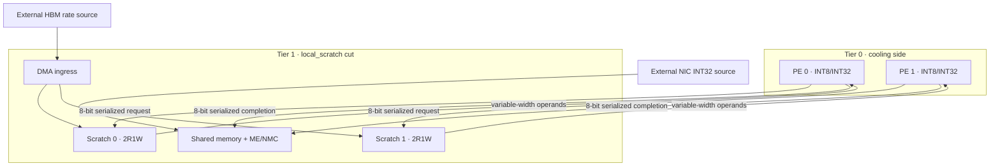

# MTIA-like 可執行模型操作手冊

版本：0.4 第一階段，2026-09-09。入口 `mtia_flow.py`。本流程把 descriptor → scratch 讀取 → INT8 PE → shared memory → ME/NMC reduction 真正接通，並以相同配置產生可合成 RTL。Python 可獨立完成搜尋、選點、驗收及匯出，無須再請 AI assembly。

這是有界的架構族研究模型。參照 [Meta MTIA 300 公開說明](https://engineering.fb.com/2026/08/24/networking-traffic/mtia-300-meta-training-chip-built-in-nics/) 的 PE/local scratch 與 memory-side collective offload 分工；coarse 切割參照 [AMD CDNA 3](https://www.amd.com/content/dam/amd/en/documents/instinct-tech-docs/white-papers/amd-cdna-3-white-paper.pdf) 的 compute-on-I/O 分層概念。未重製兩者的 ISA、網路或產品時序。來源與其他架構切割見 [代表性研究](ARCHITECTURE_REPRESENTATIVENESS.md)。

## 1. 其他 AI agent 的固定執行程序

先讀 `AGENTS.md`、`OPERATIONS_MANUAL.md`、`MODULE_RTL.md`、`ROADMAP.md` 及本文件，檢查 Git status，保留使用者其他變更。以下命令在 repository 根目錄執行，輸出目錄必須不存在。

```sh
python3 mtia_flow.py run --design examples/mtia.json --policy examples/mtia_policy.json --out runs/mtia_001
python3 mtia_flow.py verify --run runs/mtia_001
python3 quality_check.py run --design examples/modules.json --policy examples/optimization_ppa.json --out runs/ppa_mtia_001
python3 quality_check.py verify --run runs/ppa_mtia_001
```

依序檢查每個 exit code。MTIA 交付必須 M01–M06 全 PASS、獨立 verify 成功，且原有 Q01–Q09 回歸及其 verify 成功；原有 Q 驗收不代替 M 的完整網格比對。`evaluate` 僅供探索，不能作為交付成功依據。M/R 驗收的差別見第 7 節。

環境：Python 3.9+、`requirements.txt` 的 numpy/scipy/matplotlib、Icarus Verilog/VVP 與 Yosys。本機以 Python 3.9.6、Icarus 13.0、Yosys 0.68 驗證。工具搜尋依序為 `IVERILOG`/`VVP`/`YOSYS` 環境變數、PATH、既有 `.tooldeps`；不自動下載 EDA。工具缺失、timeout、無可行解及 NOT_RUN 均不是 PASS。

查看 `runs/mtia_001/search/COMPARISON.md` 與 `evaluation.json`。`search/selected_rtl/` 已是所選點的凍結 RTL；如要匯出其他通過硬限制的點，使用該次 evaluation 的唯一 ID 前綴：

```sh
python3 mtia_flow.py export --run runs/mtia_001 --point <unique-point-ID-prefix> --out runs/mtia_local_selected
```

`export` 先完整 verify 原始 run，再重算結果與參數。禁止匯出幾何不合法、超出 policy 硬限制或不存在的候選；禁止覆寫既有目錄。更動程式、RTL、tests 或 runtime 後，先建立新 run，不能修改舊 hash 以通過檢查。

探索入口（仍保存各點執行與 RTL，但不執行 M03/M04）：

```sh
python3 mtia_flow.py evaluate --design examples/mtia.json --policy examples/mtia_policy.json --out runs/mtia_explore_001
```

## 2. 三種切割與 RTL 模組

共同邏輯包含 DMA loader、每 PE 的 scratch/運算/descriptor controller、shared INT32 memory、occupied-bit barrier、ME/NMC、round-robin writeback arbiter。所有鏈路使用同一個 clock，沒有 CDC。

| 配置 | Tier 0，靠散熱端 | Tier 1 | 跨 HB payload |
|---|---|---|---|
| `2d` / CUT=0 | 全部模組 | 無 | 無；同 die 理想直連 |
| `coarse` / CUT=1 | PE + local scratch | DMA 入口、shared memory、ME/NMC | 全域 DMA、每 PE completion |
| `local_scratch` / CUT=2 | PE 與 accumulator/controller | 每 PE scratch、DMA、shared memory、ME/NMC | 每 PE address request、operand response、completion |



這是研究切割。`MI300-like coarse` 只表示 compute 與 memory-side infrastructure 的粗分層，並沒有 CDNA GPU 的 SIMT 執行行為。RTL 的 placement intent 尚未轉成兩顆 die 的獨立 netlists；外部 NIC/HBM 只提供流量源與背壓，不是硬體 PHY/controller。

| RTL | 已實作契約 |
|---|---|
| `mtia_pe.sv` | descriptor controller、scratch request/response、LANES 個 signed INT8 lane、DOT/ADD_SUM/RELU_SUM、INT32 wrapping accumulator、completion |
| `mtia_scratch.sv` | 每 byte lane 一 bank，邏輯 2 個同步 read ports + 1 DMA write port；一筆 response buffer；read-during-write 為 old data |
| `mtia_transport.sv` | CUT=0 直連；CUT=1 真正逐 chunk 序列化／重組、STAGES 延遲、單 outstanding packet、輸出背壓保持 |
| `mtia_me_nmc.sv` | shared INT32 SRAM、occupied bits 防覆寫／等待 local result，逐筆 local+NIC reduction，與 PE 並行 |
| `mtia_cluster.sv` | 上述模組接線、DMA demux、round-robin 仲裁；背壓時鎖住所選來源直到 handshake |

尚未涵蓋 RISC-V/firmware、完整 SFU/softmax、FP8/BF16、PE mesh/NoC/RDMA、bank conflicts 的其他 port 組織、HBM burst/cache miss、雙緩衝與 load/compute overlap。這些缺項不能藉修改 `DATA_W` 或名稱取得。

## 3. 設定、資料與 runtime ports

`examples/mtia.json` 是完整 schema 範例；不允許未知欄位。`parameters` 的 PES=1..4、LANES=1..16、scratch_rows/shared_entries=8..256 且為 2 的冪；每 bank 深度為 scratch_rows、每 row 為 LANES bytes。參數上限是目前驗證與執行範圍，不是 MTIA 產品規格。

`physical`：pitch 清單、每 PE local window 面積、全域 coarse window 面積、扣除預留後 signal_fraction、local_widths_bits 搜尋軸、固定 coarse_bits、link_stages=0..8。local width 為 8 的倍數，8..16×LANES bits。每個 run 的 PES/LANES/深度/STAGES 固定；目前搜尋軸為 partition、pitch、local width。要比較 PE 數或 memory 深度，用新的設計檔與獨立 run；尚無跨 run 自動 Pareto 合併。

`clock_hz` 只將 cycle 換成時間並輸出 SDC；不是已達成頻率。`max_cycles` 限制每 workload 執行；`trace_bin_cycles` 控制 power trace 分箱，最後一箱保留真實長度。

每個 workload 指定 kernel、outputs_per_pe、vectors_per_output、phases、seed、hbm_gap_cycles、nic_gap_cycles、output_stall_period。名字須唯一且符合 `[a-z][a-z0-9_]*`。

| Kernel | 可重現工作內容與數學 oracle |
|---|---|
| `gemm` | A[PES,K] × B[K,N]，K=LANES×vectors_per_output；每 PE 計算 A 的一列，B 複製到各 PE scratch；Python 整數 scalar oracle 再 wrap 到 INT32，回歸另有 NumPy INT64 對照 |
| `embedding` | seed 決定打散的 table-row 地址，讀選定向量與零向量，重複 reduction；是小型 irregular address 測試，未模擬完整 embedding cache/多 ID bag |
| `vector` | 交替執行 sum(A+B)、sum(ReLU(A))，以 vectors_per_output 重複累加 |

每個 phase 先依 HBM source gap 載入 scratch，等 DMA drain，獨立發布各 PE descriptors 及 ME descriptor。每 PE completion 寫入 shared slot，ME 依目的地址順序讀取，等待對應 NIC INT32 值，再歸約。NIC 第一筆在 launch+gap 可用，其後以成功 handshake+gap 發布；output_stall_period=N 表示 cycle%N=0 時背壓，0 表示永遠 ready，1 拒絕。phase 間等待 collective 輸出完成後才載入下一組。

所有資料通道為 `valid && ready` 的 rising-edge handshake；valid 受阻時保持資料。同步 active-high `rst` 清除控制／occupied bits，不重置 SRAM。使用者須先寫入要讀的 scratch；不可讀未初始化 memory。

匯出的 manifest 記載完整 ports 寬度。`load_data` 低位 byte 為 lane 0；`load_addr` 是 vector row；`load_pe` 指 PE。每 PE 一組 `cmd_valid/ready`；`cmd_data` 低位為 PE 0，descriptor 欄位從低到高如下，AW=log2(ROWS)、SW=log2(ENTRIES)：

| 欄位 | bits | 意義 |
|---|---:|---|
| op | 2 | 0 DOT、1 ADD_SUM、2 RELU_SUM |
| a, b, stride_a, stride_b | 各 AW | 起始 row 與每次 vector iteration 增量 |
| vectors | 16 | 1..65535；實際地址範圍仍須合法 |
| dst | SW | completion 寫入的 shared INT32 slot |

Python `encode_command()` 驗證 opcode、非零長度、最後地址不越界。外部直接驅動 RTL 時也必須遵守；RTL 沒有 runtime exception trap。`me_base/me_count` 須是 ENTRIES 範圍內、非零且不越界的連續區間，對應的每個 local slot 必须最終被供應，NIC 也須供應相同筆數。`nic_data` 與 `out_data` 為 wrapping INT32。`wb_data` 低 32 bits 是值，上方 SW bits 是 dst；wb ports 是內部路徑的觀測 taps，不是外部 ready 控制口。

## 4. HB 幾何、延遲推導與數值對照

可用 payload sites 上界為

\[
N_{sites}=\left\lfloor\frac{f_{signal}A_{window}}{p^2}\right\rfloor.
\]

local cut 每 PE 要求 `HB_BITS + 8 + 8` sites，分別是 operands、request、completion；coarse 的全域要求 `(PES+1)×COARSE_BITS` sites，涵蓋 DMA 與各 PE completion。signal_fraction 已扣除 P/G、clock/reset、handshake/control/test 及 routing reserve；這不是實體可路由／DRC 證明，也不是由 signal fraction 推估 Cu thermal fill。

範例 local window=4096 µm²、signal fraction=0.5。8/4/2 µm 的容量為 32/128/512 sites。16/64/128-bit operand links 各需 32/80/144 sites，因此 8 µm 只能選 16-bit，4 µm 可選 64-bit，2 µm 才允許 128-bit。pitch 僅改幾何可行集合；固定同寬度、STAGES 與 workload 時，模型和 RTL 執行完全相同。

對 LANES=L、address width=AW、operand width=B、link stages=S，沒有其他背壓時，local cut 連續兩次 vector 計算之間為

\[
C_{iteration}=\lceil 2AW/8\rceil+\lceil16L/B\rceil+2S+4.
\]

兩個 ceil 是 request 和 response 序列化；2S 是兩條鏈路延遲；其餘 4 拍來自 request 接受、scratch 同步讀取、response 接受與 PE 使用結果的握手路徑。這不是整個 kernel latency；完整 latency 還有載入、descriptor、completion、ME/NIC 與背壓，必須執行 dependency model。

AW=6、L=8、S=1 时，B=16/64/128 的 iteration 為 16/10/9 cycles。每 PE 共 4 個 output × 4 次 iteration，16→64 節省 96 cycles、64→128 再省 16 cycles，與完整案例 322→226→210 一致。2D 同步 scratch 的 iteration 為 2 cycles；本模型的 2D wires 無 extracted routing latency。

範例比較每個 pitch 幾何可行的最快寬度（不是全域 policy 選點）：

| Workload | local 8 µm / 16b | local 4 µm / 64b | local 2 µm / 128b | 8→2 µm latency 降幅 | 2D | coarse 64b，各可行 pitch |
|---|---:|---:|---:|---:|---:|---:|
| local_supply | 322 | 226 | 210 | 34.7826% | 91 | 254 |
| hbm_limited | 10267 | 10171 | 10155 | 1.0909% | 10036 | 10043 |
| nic_limited | 8234 | 8234 | 8234 | 0% | 8234 | 8395 |
| embedding | 340 | 244 | 228 | 32.9412% | 103 | 237 |
| vector | 348 | 252 | 237 | 31.8966% | 111 | 245 |

表中皆為 cycles。第一列 throughput 比為 322/210=1.5333；這是 local cut 內部重新加寬的收益，未證明 SoIC 比平面 ASIC 快。範例 policy 的全域選點是理想 2D，應保留此結果。

local_supply 的 40 個 DMA vectors × 8 bytes=320 HBM bytes；scratch 為 32 次雙 vector read ×16 bytes=512 bytes；PE 有 512 ops，NMC 16 adds。local HB 實際發送 512 request bits +4096 response bits +320 completion bits=4928 bits，計入最後 chunk 的 padding。在相同寬度可整除 payload 的情況下，加寬不減少這些 bits，省的是序列化等待。`execution.counts` 分開 HBM/NIC bytes、scratch/shared bytes、HB bits、PE/ME busy overlap；`stalls` 分開 source gap、DMA、operand、writeback、local-result、NIC 及 output 等待，不能把不同模組同拍 stalls 相加當總時間。

## 5. 可指定的最佳化與成本

沿用 `optimize.py` 的有限網格完整枚舉、硬限制、Pareto、weighted_sum/lexicographic。詳細目標方向、scale 與權重定義見原操作手冊。MTIA policy 須為 `quality_requirement: allow_estimates`；此 adapter 尚不支援原 module flow 的 reported point table。`timing_wns_ns` 永遠為 null；要求 WNS≥0 就無可行解，不會填假 0。

範例依序最小化 suite latency、energy、area；scale 為 0.001 ms、0.001 mJ、0.01 mm²，weight=1；area≤0.1 mm²、steady Tmax≤85°C，最後同分偏好較大 pitch。可改 policy 以 power/area/energy/steady_tmax_c 等支持指標作為目標或限制，並記錄新輸入。搜尋超過 max_candidates 就拒絕，不能無聲抽樣或替使用者放寬限制。

同一設計依次執行全部 workloads：suite latency/energy 相加、power=總 energy/總 time、throughput=總 useful ops/總 time；Tmax 是各 workload 獨立穩態 cell-average Tmax 的最大值，不是 workload 切换的 transient 峰溫。raw grid=13、geometry feasible=10；3 個幾何不可行點保留 reasons。範例把同一設計的所有工作負載各執行一次，沒有額外 hidden workload weight。

`examples/mtia_costs_synthetic.json` 定義線性 module area、idle power、action pJ。area 以 MAC lanes、control、scratch/shared bits、serializer state bits、transport lanes 計算；加寬 link 即使 padded registers 相同仍有 lane 成本。這些為粗估係數，未逐 cell 計算合成後 buffer/clock tree/control，occupied bits 等控制成本吸收在 control 係數；不得用於 foundry PPA 宣稱。

\[
E_i=P_{idle,i}T+\sum_a N_{i,a}e_a,\quad \bar P_i=E_i/T,\quad E_{mJ}=P_W T_{ms}.
\]

action counts 來自真實執行事件，能量以 pJ→J 換算。每個 power-trace bin 的 dynamic energy/實際 bin 時間，加上 idle power；完整 trace 積分必須回到總 energy。`area_mm2` 為 module area 的總和；HB slot 預算另存 `hb_site_budget_mm2`，不能相加聲稱 die footprint。

## 6. Thermal 能回答與不能回答的問題

每層 PES+1 個橫向 cells，最後一格是 ME/NMC；2D 只有一層。以實際模組活動量算平均功率，再依第 2 節分層；HB digital endpoint power 各半放在兩個 faces。

\[
G\theta=P,\quad T=T_{ambient}+\theta,\quad
\|G\theta-P\|_\infty\approx0,\quad\sum_j g_{sink,j}\theta_j=\sum_jP_j.
\]

每條內部導熱 edge 在 G 的兩個對角加 g、兩個非對角減 g；上層 sink 對角加正 conductance，因此有固定溫度邊界、解唯一。驗收檢查 node residual、總熱流及 power-trace 能量守恆。

範例的 sink/vertical/lateral conductances **固定且 synthetic，不依 pitch 改變**。同寬度縮 pitch 的 thermal 結果因此不變；重新加寬後可能因吞吐／平均功率增加而變熱，不能預設縮 pitch 降溫。沒有 junction hotspot、package/HBM/NIC power、HB Cu spreading、BEOL/TIM geometry、leakage 隨溫度變化或 transient 節流模型。

下一步有兩條可量化的校準路徑：先固定架構與工作量，匯入 module synthesis/STA/action energy 及 SRAM macro 2R1W 的可行實作；再固定功率圖，使用封裝/FEM 或量測校準 G 與 pitch-dependent spreading。拿校準後的 latency、area、energy、Tmax 同時做 Pareto，才可評估較細 pitch 的實際必要性。現有 trace 可作為外部 thermal 工具的輸入，但本階段未接上外部 solver。

## 7. 固定品質檢查、失敗與日誌

| Check | 通過條件 |
|---|---|
| M01 | schema、provenance、成本與搜尋範圍合法，凍結三份輸入 |
| M02 | 完整網格、各點各 workload scalar oracle 正確、trace/thermal 守恆、存在通過限制的 Pareto 選點 |
| M03 | 每個幾何可行點的 frozen wrapper/RTL，對所有 workload 逐 cycle 比對 valid/ready/有效資料；輸出與 writeback 背壓穩定 |
| M04 | 每個幾何可行點 Yosys hierarchy/process/check 與 generic synthesis；乘法器/邏輯 memory bits 對照、無 latch |
| M05 | deterministic replay、固定寬度控制、原始輸入未改、寫入代表性狀態 |
| M06 | source 未改、完整 RTL case coverage、所有 RTL manifests/hashes 與所選結果綁定 |

`verify` 另檢查完整 artifact inventory/hash、12 筆 START/PASS event 順序/run ID、重新執行模型與成本、凍結輸入、RTL manifests、選點/結果 binding、case 完整性及 synthesis resources。雜湊用於可重現性，沒有數位簽章／外部信任錨。

範例 M03 有 10×5=50 組 RTL replay、M04 有 10 組 synthesis。預期 PES2×LANES8=16 個乘法器，memory bits=2×8×8×64+64×32=10240；generic flow 保留 memories，不把 FF 展開面積當 SRAM macro。Yosys 不提供 Liberty mapping、APR 或 STA；SDC 只有 clock。

Python regressions 額外涵蓋手算 signed/overflow、NumPy GEMM oracle、occupied-slot等待、防覆寫下新來源到達的仲裁鎖定、零 STAGES/非整除 chunk/不同 PE/LANES、多 phase kernels、幾何界限、timeout、invalid export、成本與資料篡改。這不是全參數形式驗證。

`representation.json` 的 R01–R06 **不是全部 PASS**：R01 PARTIAL（有列明缺項）、R02 PASS（所支援整數 kernel）、R03 PASS（此模型對 RTL，非 silicon）、R04/R05 NOT_CALIBRATED（無 PPA holdout/FEM）、R06 PARTIAL（控制實驗有，校準不確定度無）。整體維持 EXPLORATORY。

`run.json`、`events.jsonl`、`QC_REPORT.md` 與 RTL/synthesis 工具 log 留在每次 run；總表 append 到 `execution_logs/mtia_history.jsonl`，原有 Q 流程仍 append `execution_logs/history.jsonl`。失败保留 FAIL/NOT_RUN，重跑用新目錄；不得刪除失敗日誌。`run/verify/export` 成功 exit 0、失敗非 0；`evaluate` 無可行解 exit 2、其他錯誤 exit 1。

## 8. 交付、證據與下一階段

完整 run 留本機。精簡稽核包放 `execution_logs/` 唯一目錄：M/Q run.json、events、QC report、輸入快照、evaluation/optimization、representation、工具摘要、所選 RTL manifest/binding、verify receipt、失敗偵測證據。大型 hex/netlist/tooldeps/runs 不提交。精簡包不是 full run，不能直接對它執行 full verify；應對原 run 或以輸入重新執行。commit/push 遵循使用者授權。

交付至少列出 run IDs/路徑、輸入、目標/限制、cost quality、候選/Pareto 數、selected ID/有效指標、M/Q 與 verify 狀態、局部收益及 HBM/NIC 反例、限制。若更改架構、模型或驗收，更新 ROADMAP。TPU training/inference 與 SIMT GPU 在本階段之後擴充；先補 module/physical 校準，可避免將 toy workload 的數字誤認為實際產品收益。
