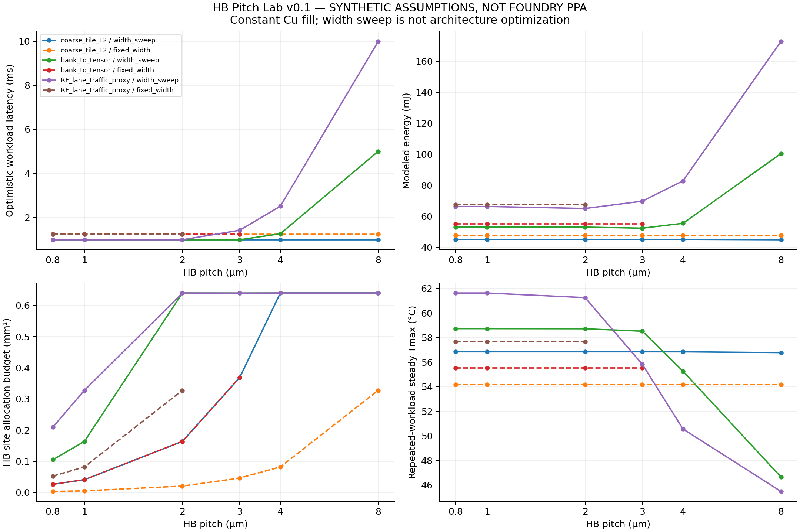
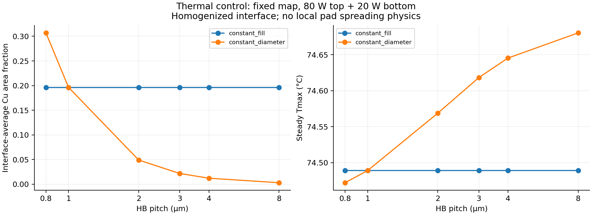

# HB Pitch Lab — example run

**Synthetic parameters; not measured or calibrated SoIC results.**

Evaluated 72 points; 62 feasible under the simplified connection budgets.
Maximum steady heat-balance residual: 2.13e-13 W.

These curves compare configured traffic proxies, not validated GPU architectures.
Width sweep opens additional lanes subject to endpoint/routing caps; it does not optimize bank counts or placement.
Constant-fill thermal invariance is a property of the homogenized model, not a proof that real pitch has no thermal effect.
The workload temperature is the steady limit of continuous repeated work, not the peak of a single short kernel.

## Next calibration steps

- Replace illustrative energies, parasitics and interface thermal resistance with measured or extracted data.
- Import cycle-level traffic and module power traces; test bank conflicts and dependency latency.
- Validate a few module APR and FEM points before claiming an optimal pitch.
